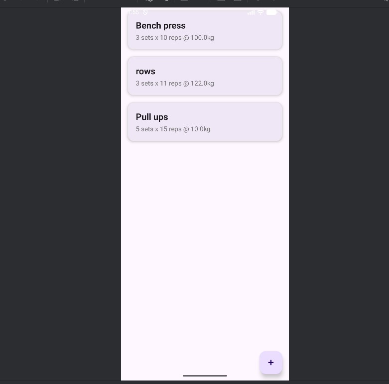
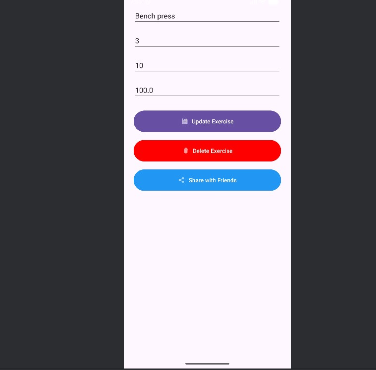

# Workout Exercises Tracker

A modern Android application for tracking gym workouts, built with Kotlin and MVVM architecture. This project helps users log their exercises, track progressive overload (sets, reps, weight), and share achievements with friends.

## 📱 Download APK
[**Download Latest Release (v1.0)**](./apk/app-release.apk)
*(Located in `/apk/app-release.apk`)*

---

## 💡 Idea
The goal of this application is to replace traditional paper workout logs with a clean, digital solution. It allows users to focus on their training by providing a quick way to record exercise data, edit history, and visualize their workout structure. The app emphasizes usability with a Material Design 3 interface and supports system-wide Dark Mode.

## ⚙️ How it Works
The application launches into a **Home Screen** displaying a list of all logged exercises, fetched from a local **Room Database** and displayed via a `RecyclerView` with custom Card views.

To log a workout:
1.  The user clicks the **Floating Action Button (+)** to navigate to the "Add Exercise" screen.
2.  Input fields collect the Exercise Name, Sets, Reps, and Weight (kg).
3.  Upon clicking "Save", the data is validated and stored in the database via the Repository.

To manage data:
* **Update:** Tapping any card opens the "Update Screen" with pre-filled data, allowing the user to modify values.
* **Delete:** A dedicated delete button removes the entry permanently from the database.
* **Share:** The "Share with Friends" feature uses an Android **Share Intent** to generate a text summary of the lift and send it via external apps (WhatsApp, Messenger, SMS).

## 🏗️ Architecture
The app follows the recommended **MVVM (Model-View-ViewModel)** architecture to ensure separation of concerns and testability.

* **Model:** `Room Database` (Entities & DAO) handles local data storage.
* **Repository:** `ExerciseRepository` acts as a single source of truth, mediating between the database and the UI.
* **ViewModel:** `ExerciseViewModel` uses `LiveData` to expose data to the UI and `Coroutines` (viewModelScope) for background database operations, preventing UI freezes.
* **View:** Fragments (`ListFragment`, `AddExerciseFragment`, `UpdateFragment`) handle the UI and observe the ViewModel for changes.

## 🛠️ Tech Stack

| Component | Technology | Description |
| :--- | :--- | :--- |
| **Language** | Kotlin | Primary development language |
| **Architecture** | MVVM | Model-View-ViewModel Pattern |
| **Database** | Room | SQLite abstraction layer |
| **Navigation** | Nav Component | Single-Activity Navigation Graph |
| **Concurrency** | Coroutines | Asynchronous operations |
| **UI** | Material 3 | Modern UI components & theming |
| **DI/Build** | Gradle KTS | Kotlin DSL build scripts |

## 🚀 User Flow
1.  **Start:** User opens app -> Sees list of exercises (or empty state).
2.  **Add:** User clicks `+` -> Enters "Bench Press", 3 sets, 10 reps, 80kg -> Clicks Save.
3.  **View:** User sees the new card appear instantly on Home screen.
4.  **Edit:** User taps the card -> Changes weight to 85kg -> Clicks Update.
5.  **Share:** User taps the card -> Clicks "Share with Friends" -> Selects Messenger -> Sends report.

## 📸 Screenshots

| Home Screen | Add Exercise | Update & Share |
| :---: | :---: | :---: |
|  |  |  |

## 🏃 Steps to Run
1.  Clone the repository:
    ```bash
    git clone [https://github.com/IvayloPladonya/MobileApps2025-2301321067.git](https://github.com/IvayloPladonya/MobileApps2025-2301321067.git)
    ```
2.  Open in **Android Studio** (Ladybug or newer recommended).
3.  Sync Gradle files.
4.  Run on an Emulator (Pixel 6 recommended) or physical device via USB.

## 🧪 Test Accounts
* **No Login Required:** The app uses a local offline database, so no authentication is needed to test the core features.

---
*Faculty Number: 2301321067 | Mobile Applications 2025*
